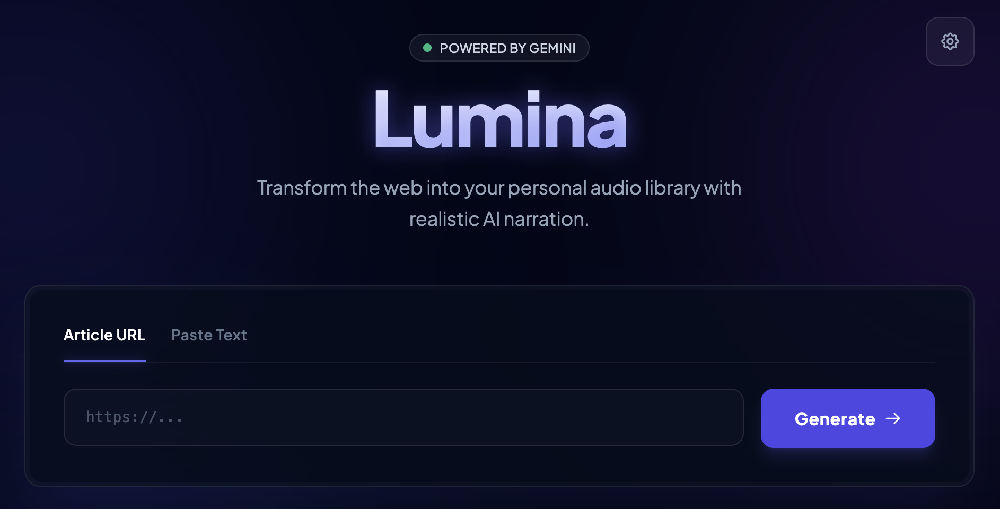

[![CraigDoesData][logo]][link]

[logo]: https://www.craigdoesdata.com/img/logo/logo.png
[link]: https://www.craigdoesdata.com/

# Lumina

Turn web articles and pasted text into natural-sounding audio using Google Gemini.

Live at https://reader-lumina.netlify.app/

## What it does
- Extracts main article text from a URL and narrates it with AI voices.
- Narrates pasted text with the same playback and voice controls.
- Lets you choose narrator voice and playback speed.
- Highlights paragraphs during playback and supports click-to-jump.
- Runs entirely in the browser with no backend.

## How it works
1. You provide a URL or paste text.
2. For URL mode, Gemini uses search grounding to pull the primary article content.
3. The text is split into paragraph-sized chunks for TTS reliability.
4. Each chunk is sent to Gemini TTS and returned as base64 audio.
5. The app decodes the audio and queues it with the Web Audio API, prefetching
   upcoming chunks for smooth playback.

## Tech stack
- React + TypeScript + Vite
- @google/genai client SDK
- Web Audio API for streaming playback
- Tailwind (CDN) + custom utility classes for styling

## Run locally
Prerequisites: Node.js

1. Install dependencies:
   `npm install`
2. Start the dev server:
   `npm run dev`
3. Open the app (Vite prints the local URL) and enter your Gemini API key when prompted.

## API key notes
- To use this app, the user needs to provide a Google Gemini API Key ([obtainable here](https://aistudio.google.com/api-keys)). The key is stored in your browser's localStorage and never sent anywhere other than to the various Gemini APIs used to parse the text and convert it to audio.
- Click "Disconnect" in the app to clear the stored key.

## Build for production
`npm run build`

Preview the production build:
`npm run preview`
